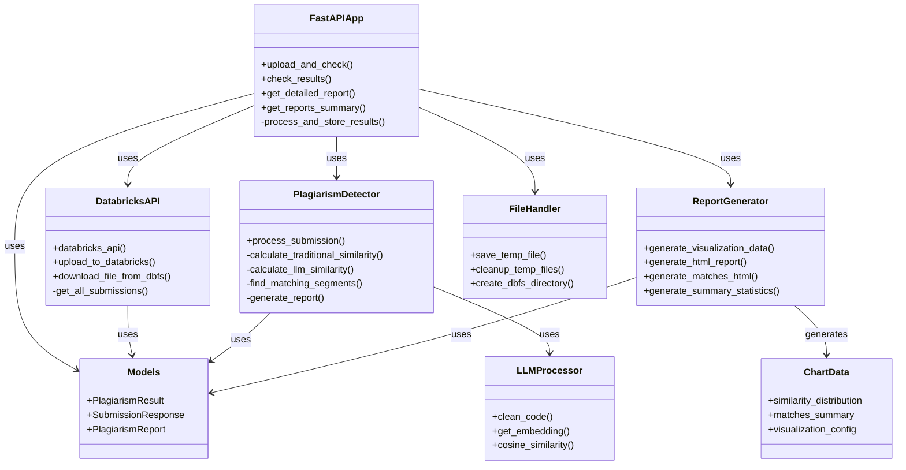

```mermaid
classDiagram
    class FastAPIApp {
        +upload_and_check()
        +check_results()
        +get_detailed_report()
        +get_reports_summary()
        -process_and_store_results()
    }

    class DatabricksAPI {
        +databricks_api()
        +upload_to_databricks()
        +download_file_from_dbfs()
        -get_all_submissions()
    }

    class PlagiarismDetector {
        +process_submission()
        -calculate_traditional_similarity()
        -calculate_llm_similarity()
        -find_matching_segments()
        -generate_report()
    }

    class LLMProcessor {
        +clean_code()
        +get_embedding()
        +cosine_similarity()
    }

    class ReportGenerator {
        +generate_visualization_data()
        +generate_html_report()
        +generate_matches_html()
        +generate_summary_statistics()
    }

    class Models {
        +PlagiarismResult
        +SubmissionResponse
        +PlagiarismReport
    }

    class FileHandler {
        +save_temp_file()
        +cleanup_temp_files()
        +create_dbfs_directory()
    }

    class ChartData {
        +similarity_distribution
        +matches_summary
        +visualization_config
    }

    FastAPIApp --> DatabricksAPI : uses
    FastAPIApp --> PlagiarismDetector : uses
    FastAPIApp --> FileHandler : uses
    FastAPIApp --> Models : uses
    FastAPIApp --> ReportGenerator : uses
    DatabricksAPI --> Models : uses
    PlagiarismDetector --> Models : uses
    PlagiarismDetector --> LLMProcessor : uses
    ReportGenerator --> ChartData : generates
    ReportGenerator --> Models : uses
```