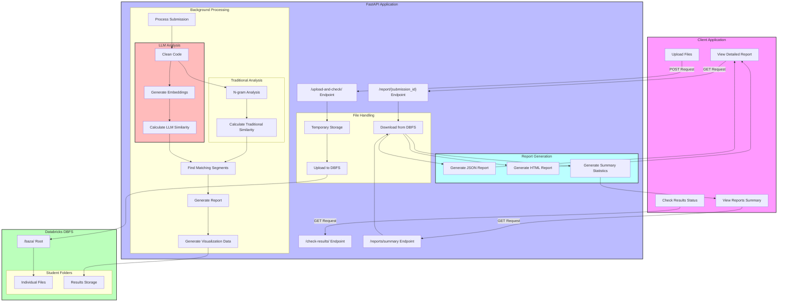

```mermaid
flowchart TB
    subgraph Client["Client Application"]
        upload[Upload Files]
        check_status[Check Results Status]
        view_report[View Detailed Report]
        view_summary[View Reports Summary]
    end

    subgraph FastAPI["FastAPI Application"]
        direction TB
        endpoint_upload["/upload-and-check/ Endpoint"]
        endpoint_results["/check-results/ Endpoint"]
        endpoint_report["/report/{submission_id} Endpoint"]
        endpoint_summary["/reports/summary Endpoint"]
        
        subgraph Background["Background Processing"]
            process[Process Submission]
            subgraph Traditional["Traditional Analysis"]
                ngram[N-gram Analysis]
                trad_sim[Calculate Traditional Similarity]
            end
            subgraph LLM["LLM Analysis"]
                clean[Clean Code]
                embed[Generate Embeddings]
                llm_sim[Calculate LLM Similarity]
            end
            find_matches[Find Matching Segments]
            gen_report[Generate Report]
            gen_viz[Generate Visualization Data]
        end

        subgraph Report_Generation["Report Generation"]
            json_report[Generate JSON Report]
            html_report[Generate HTML Report]
            summary_stats[Generate Summary Statistics]
        end

        subgraph File_Handling["File Handling"]
            temp_storage[Temporary Storage]
            upload_dbfs[Upload to DBFS]
            download_dbfs[Download from DBFS]
        end
    end

    subgraph Databricks["Databricks DBFS"]
        direction TB
        dbfs_root["/baza/ Root"]
        subgraph Folders["Student Folders"]
            student_files[Individual Files]
            results_storage[Results Storage]
        end
    end

    %% Client to FastAPI flows
    upload -->|POST Request| endpoint_upload
    check_status -->|GET Request| endpoint_results
    view_report -->|GET Request| endpoint_report
    view_summary -->|GET Request| endpoint_summary

    %% File upload flow
    endpoint_upload --> temp_storage
    temp_storage --> upload_dbfs
    upload_dbfs --> dbfs_root
    dbfs_root --> student_files

    %% Background processing flow
    process --> clean
    clean --> ngram
    clean --> embed
    ngram --> trad_sim
    embed --> llm_sim
    trad_sim --> find_matches
    llm_sim --> find_matches
    find_matches --> gen_report
    gen_report --> gen_viz
    gen_viz --> results_storage

    %% Report generation flow
    endpoint_report --> download_dbfs
    download_dbfs --> json_report
    download_dbfs --> html_report
    endpoint_summary --> download_dbfs
    download_dbfs --> summary_stats

    %% Results flow to client
    json_report --> view_report
    html_report --> view_report
    summary_stats --> view_summary

    style Client fill:#f9f,stroke:#333,stroke-width:2px
    style FastAPI fill:#bbf,stroke:#333,stroke-width:2px
    style Databricks fill:#bfb,stroke:#333,stroke-width:2px
    style LLM fill:#fbb,stroke:#333,stroke-width:2px
    style Report_Generation fill:#bff,stroke:#333,stroke-width:2px

```